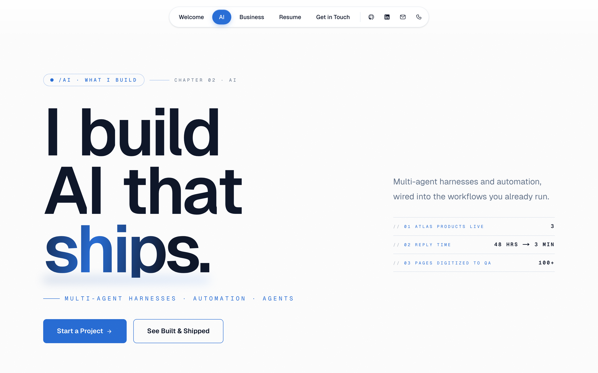
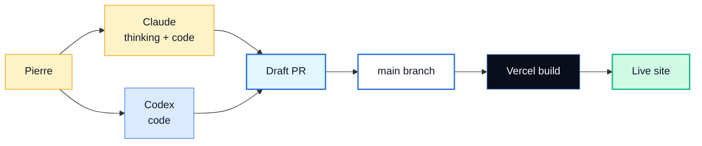

<div align="center">

# Pierre Belon Savon — Portfolio

**AI Engineer · Ocean Shores, WA · Trilingual EN / ES / IT**

Engineering intelligent automation and full-stack applications that turn complex business processes into scalable, profitable systems.

[**Live site →**](https://portfolio-psi-six-hz0jclbxci.vercel.app)

[](https://nextjs.org)
[](https://react.dev)
[](https://www.typescriptlang.org)
[](https://tailwindcss.com)
[](https://vercel.com)

</div>

---

## Preview

<p align="center">
  
</p>

<p align="center">
  
  
</p>

---

## Site map

| Route | Purpose | Highlights |
|------|---------|------------|
| `/` | Welcome | Trilingual greeting rotator, glitch-title section heads, animated counters, bento stack with real brand SVGs, live commit ticker |
| `/ai` | AI showcase | Atlas product gallery, BrowserAI-style Demo 1 (5 tabs running locally via WebGPU), Demo 2 calling Anthropic in real time |
| `/atlas` | Atlas deep-dive | Multi-agent harness — architecture, hierarchy, live demo |
| `/business` | Business case | Blackdoor + Atlas leads, before/after diagrams with big-number focal points, finance precision card |
| `/resume` | Resume | Full resume on-page, `Download Resume ↓` PDF, B&W print stylesheet |
| `/lab` | Lab | Experiments, motion sketches, work-in-progress |

---

## Live AI demos

**Demo 1 — five tasks running on your device, zero cloud:**

| Tab | Model | Task |
|-----|-------|------|
| Image Classification | MobileNet v4 | Top-5 ImageNet classification |
| LLM Chat | SmolLM2-135M | On-device text generation |
| Computer Vision | CLIP ViT-B/16 | Live webcam zero-shot gesture classification |
| Speech to Text | Whisper Tiny.en | Audio file → transcript |
| Semantic Search | mxbai-embed-xsmall | Embeddings + cosine ranking |

Models load via `@huggingface/transformers`, run on WebGPU when available, fall back to WASM on machines without WebGPU.

**Demo 2 — Atlas multi-agent harness:** sends your prompt to a Node API route at `/api/atlas/run` which calls `claude-haiku-4-5` with a system prompt that returns structured agent-routing JSON. The 3-pane UI plays back the live response (terminal stream · DB rows · task board). Falls back to a scripted simulation if the API is unavailable, rate-limited, or no `ANTHROPIC_API_KEY` is set.

---

## Tech stack

| Layer | Choice |
|-------|--------|
| Framework | Next.js 16 (App Router) · React 19 · TypeScript |
| Styling | Tailwind CSS v4 + CSS variables for design tokens |
| Animation | Framer Motion + custom CSS keyframes (glitch, scramble, light-switch) |
| Local AI | `@huggingface/transformers` (WebGPU + WASM fallback) |
| Live AI | `@anthropic-ai/sdk` (Atlas demo only, server route) |
| Brand logos | `simple-icons` |
| Analytics | `@vercel/analytics` + `@vercel/speed-insights` |
| Deployment | Vercel (Fluid Compute) |
| Source of truth for content | `context/*.md` |

---

## Quick start

```bash
npm install
npm run dev          # http://localhost:3000
npm run build        # production build
npm run lint
```

To run the live Atlas demo locally:

```bash
echo "ANTHROPIC_API_KEY=sk-ant-..." >> .env.local
npm run dev
```

Without an API key, the Atlas demo falls back to its scripted simulation.

---

## Workflow



All work goes through pull requests against `main`. Vercel deploys on merge.

---

## Project structure

```
portfolio/
├── context/                        # source of truth for content
│   ├── resume.md
│   ├── design.md
│   ├── project-scope.md
│   └── copy/                       # per-page copy
├── docs/                           # README screenshots
├── public/                         # photos, resume PDF, OG-relevant assets
├── src/
│   ├── app/                        # Next.js App Router
│   │   ├── api/atlas/run/          # Anthropic API route (live Atlas demo)
│   │   ├── atlas/                  # Atlas deep-dive
│   │   ├── business/
│   │   ├── resume/
│   │   ├── lab/                    # experiments
│   │   ├── page.tsx                # home
│   │   ├── layout.tsx              # root + SiteHeader + Analytics
│   │   ├── globals.css
│   │   ├── icon.tsx                # generated favicon
│   │   ├── opengraph-image.tsx     # generated OG card
│   │   └── not-found.tsx
│   └── components/                 # shared primitives
├── AGENTS.md                       # AI agent rules
├── CLAUDE.md                       # Claude-specific instructions
└── README.md
```

---

## Key documents

- [`context/resume.md`](./context/resume.md)
- [`context/design.md`](./context/design.md)
- [`context/project-scope.md`](./context/project-scope.md)
- [`AGENTS.md`](./AGENTS.md)
- [`CLAUDE.md`](./CLAUDE.md)

---

## Contact

**Pierre Belon Savon** — AI Engineer

[belonsavon@gmail.com](mailto:belonsavon@gmail.com) · 360-660-2460
[github.com/belonsavon-sys](https://github.com/belonsavon-sys) · [linkedin.com/in/pierre-belon-8366b8407](https://www.linkedin.com/in/pierre-belon-8366b8407)
