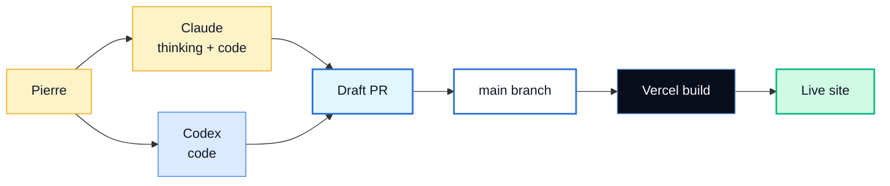

# Pierre Belon Savon — AI Engineer Portfolio

> Engineering intelligent automation and full-stack applications that turn complex business processes into scalable, profitable systems.

A Next.js (App Router) portfolio for **Pierre Belon Savon**. Business-first framing throughout. Live demos use WebGPU + a real Anthropic API call. Deployed on Vercel.

**Live preview** · [`/opengraph-image`](./src/app/opengraph-image.tsx) is generated at edge runtime when the site is unfurled on social.

---

## Site map

| Route | Purpose | Highlights |
|------|---------|------------|
| `/` | Welcome | Trilingual greeting rotator, animated counters, bento stack with real brand SVGs, "Beyond the Code" mesh-gradient band |
| `/ai` | AI showcase | Atlas product gallery, BrowserAI-style Demo 1 (5 tabs running locally via WebGPU), Demo 2 calling Anthropic in real time |
| `/business` | Business case | Blackdoor + Atlas leads, before/after diagrams with big-number focal points, finance precision card |
| `/resume` | Resume | Full resume on-page, `Download Resume ↓` PDF, B&W print stylesheet |
| `/contact` | Get in Touch | Dark-glass page with GitHub · LinkedIn · Email · Phone glass cards |

---

## Live AI demos

**Demo 1 — five tasks running on your device, zero cloud:**

| Tab | Model | Task |
|-----|-------|------|
| Image Classification | MobileNet v4 | Top-5 ImageNet classification |
| LLM Chat | SmolLM2-135M | On-device text generation |
| Computer Vision | CLIP ViT-B/16 | Live webcam zero-shot gesture classification |
| Speech to Text | Whisper Tiny.en | Audio file → transcript |
| Semantic Search | mxbai-embed-xsmall | Embeddings + cosine ranking |

Models load via `@huggingface/transformers`, run on WebGPU when available, fall back to WASM on machines without WebGPU.

**Demo 2 — Atlas multi-agent harness:** sends your prompt to a Node API route at `/api/atlas/run` which calls `claude-haiku-4-5` with a system prompt that returns a structured agent-routing JSON. The 3-pane UI then plays back the live response (terminal stream · DB rows · task board). Falls back to a scripted simulation if the API is unavailable, rate-limited, or no `ANTHROPIC_API_KEY` is set.

---

## Tech stack

| Layer | Choice |
|-------|--------|
| Framework | Next.js 16 (App Router) · React 19 · TypeScript |
| Styling | Tailwind CSS v4 + CSS variables for design tokens |
| Animation | Framer Motion |
| Local AI | `@huggingface/transformers` (WebGPU + WASM fallback) |
| Live AI | `@anthropic-ai/sdk` (Atlas demo only, server route) |
| Brand logos | `simple-icons` |
| Analytics | `@vercel/analytics` |
| Deployment | Vercel |
| Source of truth for content | `context/*.md` |

---

## Workflow



All work goes through pull requests against `main`. Vercel deploys on merge.

---

## Quick start

```bash
npm install
npm run dev          # http://localhost:3000
npm run build        # production build
```

To run the live Atlas demo locally:

```bash
echo "ANTHROPIC_API_KEY=sk-ant-..." >> .env.local
npm run dev
```

Without an API key, the Atlas demo falls back to its scripted simulation.

---

## Project structure

```
portfolio/
├── context/                        # source of truth for content
│   ├── resume.md
│   ├── design.md
│   ├── project-scope.md
│   ├── cover-letter.md
│   └── copy/                       # per-page copy
├── public/                         # photos, resume PDF, OG-relevant assets
├── src/
│   ├── app/                        # Next.js App Router
│   │   ├── api/atlas/run/          # Anthropic API route (live Atlas demo)
│   │   ├── ai/page.tsx
│   │   ├── business/page.tsx
│   │   ├── resume/page.tsx
│   │   ├── contact/page.tsx
│   │   ├── page.tsx                # home
│   │   ├── layout.tsx              # root + SiteHeader + Analytics
│   │   ├── globals.css
│   │   ├── icon.tsx                # generated favicon
│   │   ├── opengraph-image.tsx     # generated OG card
│   │   └── not-found.tsx
│   └── components/                 # shared primitives
├── AGENTS.md                       # AI agent rules
├── CLAUDE.md                       # Claude-specific instructions
└── README.md
```

---

## Status

| Phase | State |
|-------|------|
| Phase 1 — Content & Resume | ✅ Complete |
| Phase 2 — Design & Brandkit | ✅ Complete |
| Phase 3 — Build (Next.js) | ✅ Complete |
| Phase 4 — Deploy | 🟡 Live on Vercel · custom domain TBD · `ANTHROPIC_API_KEY` env var to be set in Vercel before production live demo works |

---

## Key documents

- [`context/resume.md`](./context/resume.md)
- [`context/design.md`](./context/design.md)
- [`context/project-scope.md`](./context/project-scope.md)
- [`AGENTS.md`](./AGENTS.md)
- [`CLAUDE.md`](./CLAUDE.md)

---

## Contact

**Pierre Belon Savon** · AI Engineer · Ocean Shores, WA · Trilingual EN / ES / IT

[belonsavon@gmail.com](mailto:belonsavon@gmail.com) · 360-660-2460 · [github.com/belonsavon-sys](https://github.com/belonsavon-sys) · [linkedin.com/in/pierre-belon-8366b8407](https://www.linkedin.com/in/pierre-belon-8366b8407)
