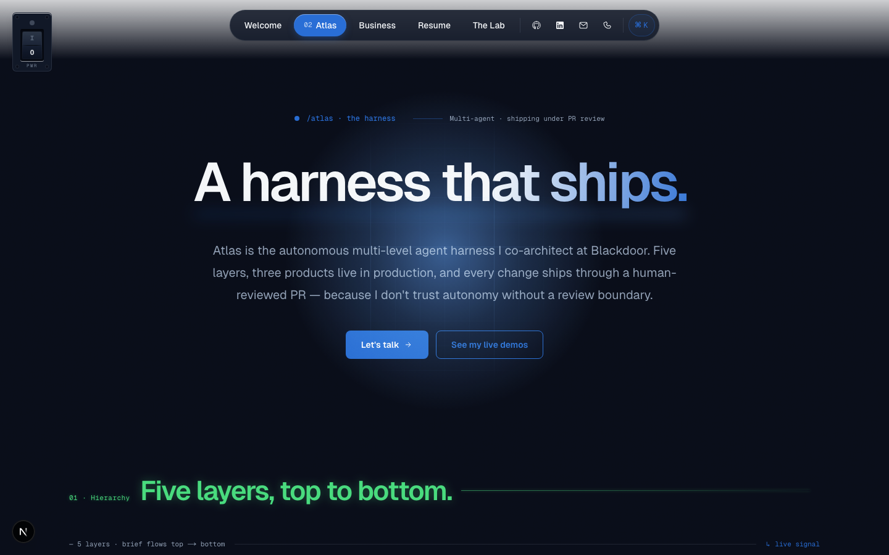
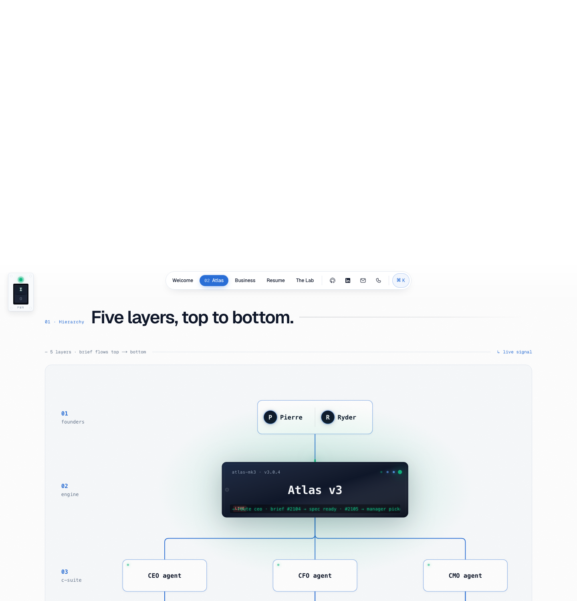
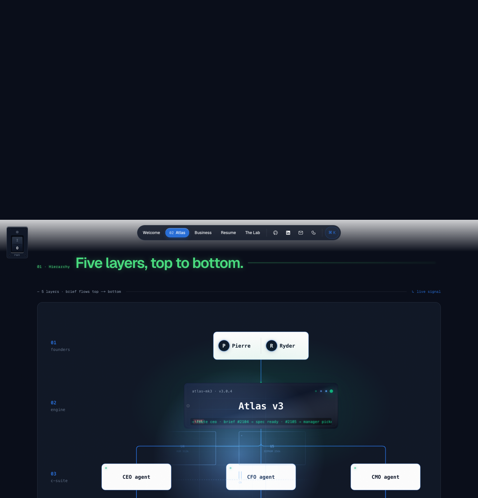
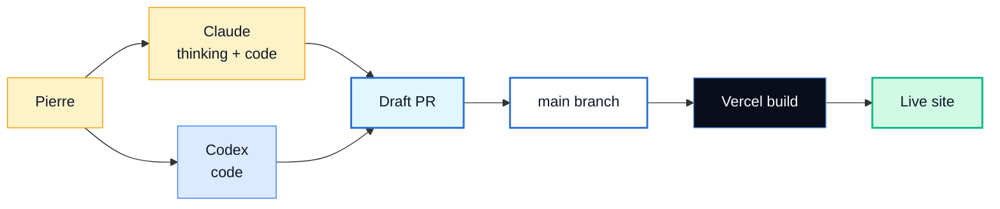

<div align="center">

# Pierre Belon Savon — Portfolio

**AI Engineer · Ocean Shores, WA · EN · ES · IT**

I build AI for businesses that have to actually run.
Most of it I shipped while running one.

[**Live site →**](https://portfolio-psi-six-hz0jclbxci.vercel.app)

[](https://nextjs.org)
[](https://react.dev)
[](https://www.typescriptlang.org)
[](https://tailwindcss.com)
[](https://gsap.com)
[](https://vercel.com)

</div>

---

## Preview

<p align="center">
  
</p>

<table align="center" width="100%">
  <tr>
    <td width="50%" align="center"><sub><b>/atlas</b> — light room</sub></td>
    <td width="50%" align="center"><sub><b>/atlas</b> — flashlight room (dark + green-neon section headers)</sub></td>
  </tr>
  <tr>
    <td></td>
    <td></td>
  </tr>
</table>

<table align="center" width="100%">
  <tr>
    <td width="33%"></td>
    <td width="33%"></td>
    <td width="33%"></td>
  </tr>
  <tr>
    <td align="center"><sub><b>/business</b></sub></td>
    <td align="center"><sub><b>/lab</b></sub></td>
    <td align="center"><sub><b>/resume</b></sub></td>
  </tr>
</table>

<table align="center" width="100%">
  <tr>
    <td width="50%"></td>
    <td width="50%"></td>
  </tr>
  <tr>
    <td align="center"><sub><b>Atlas hierarchy</b> — schematic blueprint with engine chip, bus wires, and datasheet rows.</sub></td>
    <td align="center"><sub>Same view in flashlight mode — section headers in green-neon, schematic dimmed to blueprint.</sub></td>
  </tr>
</table>

---

## Site map

| Route | What it is | Signature beat |
|------|-----------|----------------|
| `/` | Welcome | GSAP gradient title reveal · live commit ticker · last-shipped feed |
| `/atlas` | Atlas deep-dive | Schematic blueprint of the multi-agent harness · datasheet cascade · ShipFlow trace |
| `/business` | Business case | Operator-facing bento grid · before/after diagrams · finance precision card |
| `/lab` | What I'm shipping | In-browser AI demos · stack I pay for · how this site was built |
| `/resume` | Résumé | Full résumé on-page · PDF download · B&W print stylesheet |

---

## Signature interactions

The site has one cohesive interaction language. Every page reuses the same primitives.

### Flashlight dark mode

A PCB rocker switch in the top-left corner flips the entire site into a dark room. The toggle uses the **View Transitions API** with direction-aware keyframes:

- **dark → light** — the dark layer collapses inward to a point at the rocker, revealing the light layer behind it
- **light → dark** — the dark layer expands outward from the rocker, sweeping over the light layer

CSS `clip-path: circle()` keyframes are bound to `--toggle-cx` / `--toggle-cy` custom properties that the switch sets to its viewport-center coords before kicking off `document.startViewTransition()`. `flushSync` inside the callback keeps the React state update and `body.dark` class flip inside the snapshot window.

`body.dark` rebinds the `--*-light` design tokens to their dark counterparts so every `bg-bg-light` / `text-text-light` / `border-border-light` reference inverts automatically. Hardcoded `bg-white/X` surfaces (nav pill, popovers, chip rails) get inverted via `body.dark` overrides.

In flashlight mode the cursor becomes a lamp: a brighter accent bloom centered on the pointer plus an X-ray schematic tile (PWR · CPU · MEM · I/O) revealed only inside a radial mask that follows the cursor and scrolls with the page.

### Hero title reveal (GSAP)

Every page hero uses `<HeroSplitTitle>` — a single-element GSAP timeline that animates `clip-path: inset(0 100% 0 0)` → `inset(0 0 0 0)` with a tiny y-slide and blur clear, landing on the `.gradient-shift` color sweep. Outer `.auto-glitch` on the `<h1>` keeps the hover chromatic-aberration.

The reveal stays continuous (single element preserves the gradient as one sweep — per-char would flash the accent in every character independently). The same component drives all five page heroes for consistency.

### Atlas datasheet cascade (GSAP ScrollTrigger)

Below the hierarchy schematic on `/atlas`, each datasheet row assembles as it enters the viewport:

1. Refdes strip fades + slides up (`[01 · J1]`-style tag)
2. Title clip-paths in with a blur clear (same pattern as the hero)
3. Body paragraph fades up
4. Three KPI tiles stagger pop

Beats overlap with negative offsets so the cascade feels brisk. `toggleActions: "play none none reverse"` replays the reveal each time the row crosses the trigger — rows greet the reader on scroll-back instead of baking in once.

### Section headers (GlitchTitle)

Section headers sit dark at rest, run subtle chromatic-aberration micro-flickers, and pop deep-emerald x-ray on a 5-second heartbeat. **In dark mode** the resting state stays in the green-neon "hack" visual permanently — done by rebinding `--gt-text-rest` / `--gt-line-rest-bg` / `--gt-chapter-rest` CSS variables that the existing `glitch-title-xray` keyframes already read.

### Chapter rail

Bottom-right vertical pill mounted via `createPortal` to escape ancestor `filter`/`transform` containing blocks. Index-only buttons (`01` · `02` · `03`) with an IntersectionObserver-driven active state. The back-to-top arrow on top is ringed by a conic scroll-progress gauge that fills 0° → 360° as the reader moves through the page.

### URL flags

A few flags useful for shared links and capture:

- `?lights=on` / `?lights=off` — open the site in a specific theme
- `?frozen=1` — pin GSAP animations to their resting state (used for screenshots and OG previews)

---

## Live AI demos

Both demos live on `/atlas`.

**Local AI — five tasks running on your device, zero cloud:**

| Tab | Model | Task |
|-----|-------|------|
| Image Classification | MobileNet v4 | Top-5 ImageNet classification |
| LLM Chat | SmolLM2-135M | On-device text generation |
| Computer Vision | CLIP ViT-B/16 | Live webcam zero-shot gesture classification |
| Speech to Text | Whisper Tiny.en | Audio file → transcript |
| Semantic Search | mxbai-embed-xsmall | Embeddings + cosine ranking |

Models load via `@huggingface/transformers`, run on WebGPU when available, fall back to WASM.

**Atlas harness — multi-agent routing:** sends your prompt to `/api/atlas/run` which calls `gpt-4o-mini` with a system prompt that returns structured agent-routing JSON. The 3-pane UI plays back the live response (terminal stream · DB rows · task board). Falls back to a scripted simulation when no `OPENAI_API_KEY` is set or the API is rate-limited (3 calls per IP per hour).

---

## Tech stack

| Layer | Choice |
|-------|--------|
| Framework | Next.js 16 (App Router · Turbopack) · React 19 · TypeScript 5 |
| Styling | Tailwind CSS v4 · CSS custom properties for design tokens · `body.dark` class for theme |
| Animation | GSAP 3 (`ScrollTrigger`) · Framer Motion · CSS keyframes (glitch, gradient sweep, atmosphere) |
| Transitions | View Transitions API for the flashlight toggle |
| Local AI | `@huggingface/transformers` (WebGPU + WASM fallback) |
| Server AI | `openai` SDK · `gpt-4o-mini` for the Atlas harness demo |
| Brand logos | `simple-icons` |
| Analytics | `@vercel/analytics` + `@vercel/speed-insights` |
| Deployment | Vercel (Fluid Compute) |
| Content source | `context/*.md` |

---

## Quick start

```bash
npm install
npm run dev         # http://localhost:3000
npm run build       # production build
npm run lint
```

Optional — to run the live Atlas demo locally:

```bash
echo "OPENAI_API_KEY=sk-..." >> .env.local
npm run dev
```

Without an API key, the Atlas demo falls back to its scripted simulation.

---

## How I work



Every change goes through a pull request against `main`. Vercel deploys on merge.

---

## Project structure

```
portfolio/
├── context/                       # source of truth for content
│   ├── resume.md
│   ├── design.md
│   ├── project-scope.md
│   └── copy/                      # per-page copy
├── docs/                          # README screenshots
├── public/                        # photos, resume PDF, OG assets
├── src/
│   ├── app/                       # Next.js App Router
│   │   ├── api/atlas/run/         # Anthropic API route (live Atlas demo)
│   │   ├── atlas/                 # Atlas deep-dive
│   │   ├── business/
│   │   ├── resume/
│   │   ├── lab/                   # The Lab
│   │   ├── page.tsx               # home
│   │   ├── layout.tsx             # root + SiteHeader + PageAtmosphere + LightSwitchProvider
│   │   ├── globals.css            # tokens, themes, view-transition keyframes, glitch keyframes
│   │   ├── icon.tsx               # generated favicon
│   │   ├── opengraph-image.tsx    # generated OG card
│   │   └── not-found.tsx
│   └── components/                # shared primitives
│       ├── HeroSplitTitle.tsx     # GSAP clip-path reveal — hero on every page
│       ├── LightSwitch.tsx        # PCB rocker switch
│       ├── LightSwitchContext.tsx # flashlight state + View Transitions wiring
│       ├── PageAtmosphere.tsx     # cursor flashlight + X-ray reveal
│       ├── AtlasHierarchy.tsx     # schematic + datasheet cascade
│       ├── ShipFlow.tsx           # flow / code toggle with perimeter trace
│       ├── ChapterRail.tsx        # vertical bottom-right section pill
│       ├── GlitchTitle.tsx        # section headers (light slate ↔ dark green-neon)
│       └── … (Button, BentoStack, BeforeAfter, CommitTicker, TextScramble, …)
└── README.md
```

---

## Key documents

- [`context/resume.md`](./context/resume.md) — the source for `/resume`
- [`context/design.md`](./context/design.md) — design tokens and motion language
- [`context/project-scope.md`](./context/project-scope.md) — what's in scope and what isn't
- [`context/cover-letter.md`](./context/cover-letter.md) — the working letter

---

## Contact

**Pierre Belon Savon** — AI Engineer

[belonsavon@gmail.com](mailto:belonsavon@gmail.com) · 360-660-2460
[github.com/belonsavon-sys](https://github.com/belonsavon-sys) · [linkedin.com/in/pierre-belon-8366b8407](https://www.linkedin.com/in/pierre-belon-8366b8407)
