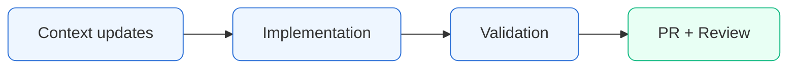

# Pierre Belon Savon — Portfolio 

AI engineer portfolio focused on measurable business outcomes.

## Live Preview
- OG preview image: `public/og-preview.png` (or generated OpenGraph route)

## Quick Start
```bash
npm install
npm run dev
```

## Site Map
| Page | Route | Description | Status |
|---|---|---|---|
| Home | `/` | Hero, Outcomes, About, Beyond the Code, Stack, CTA | ✅ |
| AI | `/ai` | Services, case studies, Atlas gallery, Local AI demo, Atlas runtime demo | ✅ |
| Business | `/business` | Blackdoor-led narrative + operations outcomes | ✅ |
| Resume | `/resume` | ATS-friendly resume view + PDF download | ✅ |
| Contact | `/contact` | Direct contact links, no form | ✅ |

## Tech Stack
| Group | Tools |
|---|---|
| Framework | Next.js App Router, React, TypeScript |
| Styling | Tailwind CSS, custom design tokens |
| Animation | Framer Motion |
| AI Runtime | Transformers.js (local), Anthropic SDK (server route) |
| Deployment | Vercel |

## Workflow
Build copy in `context/` first, then implement in `src/`, then validate with TypeScript/lint/build before merge.



## Project Structure
- `context/` source-of-truth content and design direction
- `src/app/` routes/pages
- `src/components/` reusable UI and demo primitives
- `public/` static assets
