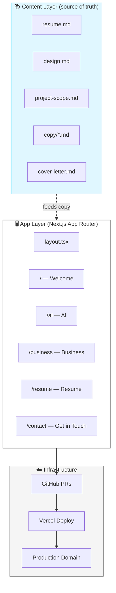
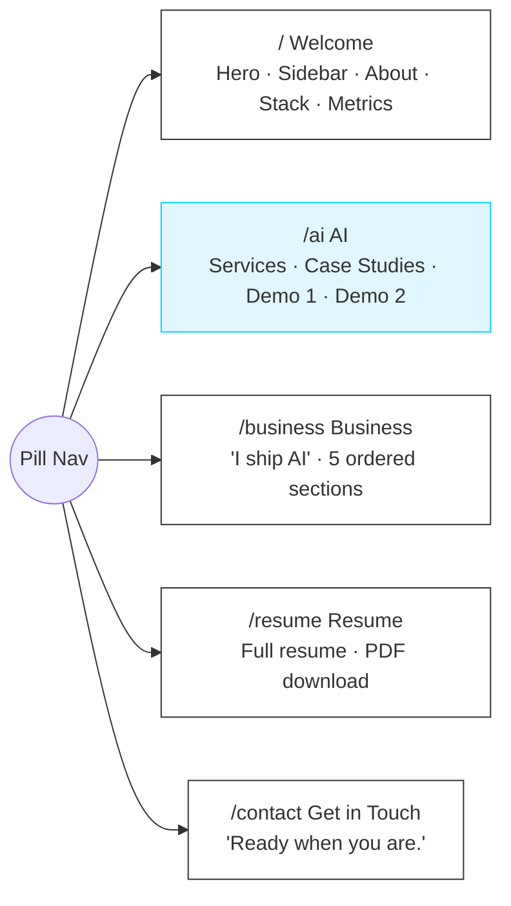
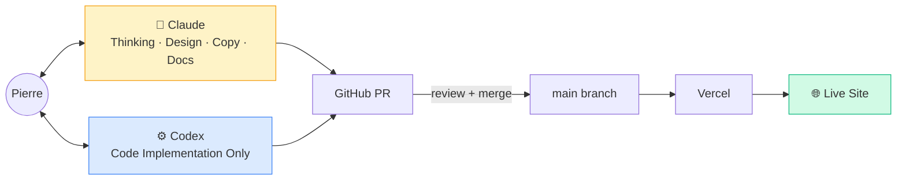

# Pierre Belon Savon — AI Engineer Portfolio

> Engineering intelligent automation and full-stack applications that turn complex business processes into scalable, profitable systems.

A Next.js (App Router) portfolio site for **Pierre Belon Savon**, AI Engineer. Built business-first: every page leads with outcomes, not technology. Deployed on Vercel.

---

## Architecture



---

## Site Map



---

## AI-Driven Workflow



---

## Tech Stack

| Layer | Technology |
|-------|-----------|
| Framework | Next.js (App Router) |
| Language | TypeScript |
| Styling | Tailwind CSS + CSS variables |
| Animation | Framer Motion |
| Database | Supabase (if needed) |
| Demos (Demo 1) | WebGPU + Transformers.js — local AI in browser |
| Demos (Demo 2) | Simulated 3-pane Atlas walkthrough |
| Deploy | Vercel |
| Source of truth | `/context/*.md` (flat content files) |

---

## Repository Structure

```
portfolio/
├── context/                  ← All content lives here. Source of truth.
│   ├── resume.md             ← Full resume data
│   ├── design.md             ← Visual direction + brandkit
│   ├── project-scope.md      ← Site map, demos, workflow
│   ├── cover-letter.md       ← Cover letter draft
│   └── copy/
│       ├── home.md           ← Welcome page copy
│       ├── ai.md             ← AI page copy
│       ├── business.md       ← Business page copy
│       └── contact.md        ← Get in Touch page copy
├── src/app/                  ← Next.js App Router (TBD)
├── public/                   ← Static assets
├── AGENTS.md                 ← AI agent rules and workflow
├── CLAUDE.md                 ← Claude-specific instructions
└── .gitignore
```

---

## Status

| Phase | Status |
|-------|--------|
| Phase 1 — Content & Resume | ✅ Complete |
| Phase 2 — Design & Brandkit | 🟡 In progress |
| Phase 3 — Build (Next.js) | ⬜ Not started |
| Phase 4 — Deploy | ⬜ Not started |

**Open blockers:** Hero photo · LinkedIn profile · Domain name · Demo asset production

---

## Key Documents

- [`context/resume.md`](./context/resume.md) — Resume source
- [`context/design.md`](./context/design.md) — Design direction
- [`context/project-scope.md`](./context/project-scope.md) — Full project scope
- [`AGENTS.md`](./AGENTS.md) — AI agent workflow rules
- [`CLAUDE.md`](./CLAUDE.md) — Claude-specific instructions

---

## Contact

**Pierre Belon Savon**
AI Engineer · Ocean Shores, WA · Trilingual (EN / ES / IT)
[belonsavon@gmail.com](mailto:belonsavon@gmail.com) · 360-660-2460 · [github.com/belonsavon-sys](https://github.com/belonsavon-sys)
