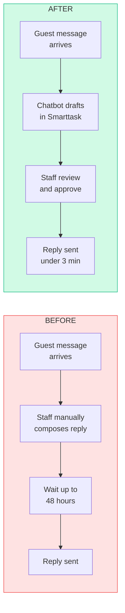
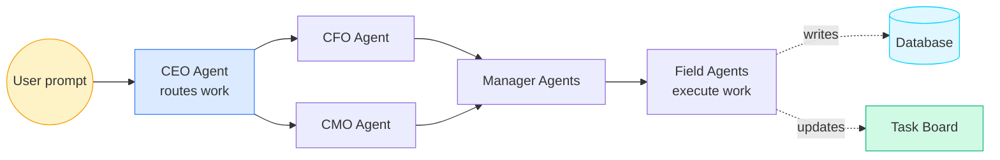

# AI Page Copy — Pierre Belon Savon

## Route: `/ai`

---

## Page Hero (LOCKED)

**Headline:**
> "I build AI that ships."

**Subtext:**
> Agent harnesses, process automation, full-stack applications — built to change how your business operates, not just to impress in a demo.

---

## Services Section

**Heading:** What I Build

**Service cards (each with icon, name, 1-line description):**

1. **Process Automation**
   Turn your manual workflows into automated systems. API integrations, Zapier flows, and custom pipelines that run without you.

2. **Custom Chatbot Development**
   AI-powered communication tools trained on your data, tuned to your brand voice, and connected to your existing tools — with every action reviewed before it executes.

3. **Full-Stack Web & Mobile Apps**
   End-to-end applications built to solve a specific business problem. From idea to deployed product, built with the right stack for the outcome.

4. **Agent Harness Design (Atlas-style)**
   Multi-level autonomous agent systems that route work, spin up sub-agents, and take action — modeled on the same architecture powering Blackdoor.

5. **Anything a Business Pays For**
   If you have a problem and need AI to solve it, I'll figure out how.

---

## Automation Case Studies

**Heading:** Built and Shipped

### Guest Communications Chatbot

**Before vs After:**



**The problem:** Guest messages at ThePrivateHotels were taking up to 48 hours to receive a response. Missed notifications meant guests sometimes waited days.

**What I built:** A chatbot trained on curated company data — approved message templates, brand voice, every guest scenario from check-in instructions to pet rules to TV troubleshooting. It drafts replies inside Smarttask. Staff review, approve, and send in seconds.

**The result:** Response time dropped from up to 48 hours → under 3 minutes. Every message saves 15–20 minutes of manual drafting. Consistent brand voice. Zero unapproved messages sent.

---

### Operations Manual → QA System
**The problem:** A 100+ page property operations manual. No way to track compliance, audit performance, or hold anyone accountable to standards.

**What I built:** Digitized the entire manual into a trackable, quantifiable inspection system — room by room, process by process. Static documentation became an auditable QA tool.

**The result:** Inspections are now measurable. Staff are accountable to defined standards. Property maintains top-10% Airbnb rating and Booking.com Travelers' Choice award.

---

### Workflow Automation (Zapier + Guesty + Twilio)
**The problem:** Hotel operations ran on manual coordination — messages, bookings, and communications all requiring human handoffs.

**What I built:** A connected automation layer using Zapier, Guesty API, and Twilio API — replacing multi-hour coordination loops with automated triggers and responses.

**The result:** Manual coordination significantly reduced. Team focuses on decisions, not data movement.

---

## Demo 1 — Live AI in Your Browser

**Section heading:** Local AI. Real business. No cloud required.

**Intro copy:**
> Cloud AI is everywhere. But compute and energy costs are rising, and every modern computer already has the hardware to run capable AI models locally — they just aren't being used that way yet. These demos show what that looks like when it's actually deployed.

**Tab labels and business framing:**

| Tab | Business framing |
|-----|-----------------|
| LLM | Ground an AI agent in your business context — run it entirely on-device, zero data leakage |
| Vision | Classify images for inventory management, QA inspection, or ML dataset labeling |
| Semantic Search | Find meaning in your business data — not just keywords, but intent and relevance |
| Speech | Transcribe meeting audio to text and read documents back aloud — multi-speaker, with expression |
| Image Generation | Generate product mockups and business visuals on-device, on demand |

**Footer note:** All models run locally in your browser via WebGPU. No data leaves your device.

---

## Demo 2 — Atlas: Watch an Agent Work

**Section heading:** This is what an agent harness looks like in motion.

**Intro copy:**
> Atlas is the multi-agent system I co-architect at Blackdoor. Send a prompt. Watch the CEO agent route it. Sub-agents act. The database updates. Tasks appear, get assigned, get completed. This is what AI that ships looks like under the hood.

**Visualization:**



**3-pane layout shown to the visitor:**

```
┌──────────────────┬──────────────────┬──────────────────┐
│  PANE 1          │  PANE 2          │  PANE 3          │
│  Harness         │  Database        │  Task Board      │
│  Terminal        │                  │                  │
│                  │  ┌─────────────┐ │  ┌─────────────┐ │
│  > prompt: ...   │  │ tasks       │ │  │ ◯ Build...  │ │
│  > CEO routing   │  │  + new row  │ │  │ ◐ Deploy... │ │
│  > Agent CFO ack │  │  ↻ updated  │ │  │ ● Done!     │ │
│  > Field active  │  │             │ │  │             │ │
│  $ █             │  └─────────────┘ │  └─────────────┘ │
└──────────────────┴──────────────────┴──────────────────┘
```

**Pane labels:**
- Pane 1: **Harness Terminal** — live routing and agent activity
- Pane 2: **Database** — records being written in real time
- Pane 3: **Task Board** — work appearing and completing

---

## CTA Section

**Heading:** Ready to ship something real?

**Subtext:** Remote. Available now. I reply within 24 hours.

**Button:** Get in Touch →
