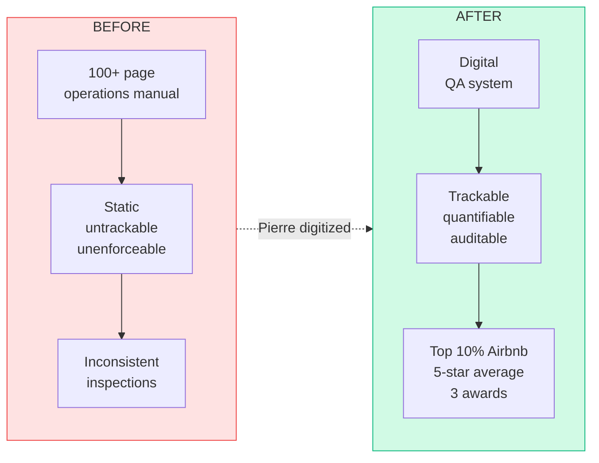
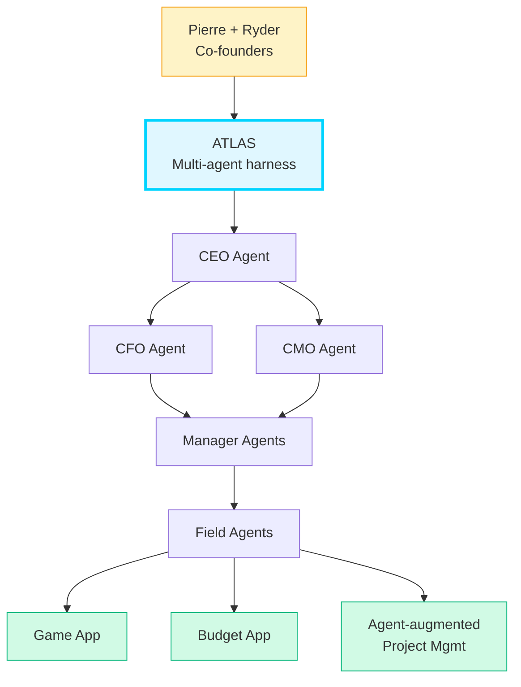

# Business Page Copy — Pierre Belon Savon

## Route: `/business`

---

## Page Hero

**Headline:**
> "I ship AI."

**Subtext:**
> Not plans. Not decks. Systems running in production, solving real problems, delivering measurable results — built from inside the operations I was hired to run.

---

## Section 1 — Process Design & Digitization

**Heading:** I turn chaos into auditable systems.

**Before vs After:**

**Copy:**
> When I arrived at ThePrivateHotels, operations ran on a 100+ page manual that no one could practically enforce. Inspections were inconsistent. Accountability was guesswork.
>
> I digitized the entire manual — room by room, process by process — into a trackable, quantifiable inspection system. Every standard became a measurable checkpoint. Every housekeeper, every contractor, every property is now held to the same defined criteria.
>
> The result: top-10% Airbnb rating, Booking.com Travelers' Choice Award, VRBO Premier Partner status, and a 5-star average across the board.
>
> I build these systems for businesses. If you're running on guesswork, I'll give you a system that knows.

**What this looks like for your business:**
- Manual → digital, trackable, auditable
- Consistent standards across locations and teams
- Accountability built into the workflow, not bolted on afterward

---

## Section 2 — Customer & Guest Communications

**Heading:** Faster answers. Consistent voice. Zero missed messages.

**Copy:**
> Guest response time at ThePrivateHotels used to run up to 48 hours. A missed notification could mean a guest waited days.
>
> I built a chatbot trained on curated company data — brand voice, approved templates, every scenario a guest might raise. It drafts replies inside our operating system. We review, approve, send. Response time: under 3 minutes. Per message, it saves 15–20 minutes of manual composition.
>
> Every response reflects the brand. Every action is human-approved before it goes out.

**What this looks like for your business:**
- Response times measured in minutes, not hours
- Brand-consistent communication at scale
- Human oversight maintained — AI drafts, people decide

---

## Section 3 — Team Leadership & Training

**Heading:** I build teams that can run systems I build.

**Copy:**
> Building a system is half the job. The other half is making sure your team can use it — and maintain the standard when you're not watching.
>
> At ThePrivateHotels I supervised 6 people across two teams and managed contractor relationships for ongoing construction. I authored room-by-room SOPs, laundry procedures, inspection checklists — documentation clear enough that a new hire could onboard without confusion.
>
> I also trained staff on all tools and systems I deployed: the inspection platform, communication tools, and pet protocols. Standards didn't slip because the team understood why they existed.

**What this looks like for your business:**
- Clear SOPs that anyone can follow
- Staff trained on the tools, not just told to use them
- Accountability that doesn't require you to be in the room

---

## Section 4 — Blackdoor Operations

**Heading:** Building the company that builds companies.

**Atlas hierarchy (the engine inside Blackdoor):**

**Copy:**
> Blackdoor is the holding company I co-founded with Ryder in 2025. We develop and operate agentic companies across entertainment, SaaS, robotics, and AI.
>
> At Blackdoor, I lead AI R&D and implementation. Our core product is Atlas — a multi-level autonomous agent harness where a CEO agent routes work to C-suite agents (CFO, CMO), who delegate to manager and field agents. The system is designed to build, operate, and improve software products autonomously over time.
>
> Atlas has already shipped a game app, a budget web app, and an agent-augmented project management system. The same underlying technology is deployed at ThePrivateHotels.
>
> We run everything through GitHub PRs. Full research and documentation before any implementation sprint. Every decision is governed.

**What this means:**
- Proven ability to architect and ship agentic systems
- Experience running multi-agent pipelines in real business contexts
- A co-founder mindset: I take ownership and see things through

---

## Section 5 — Finance & Administration

**Heading:** Precision behind the scenes.

**Copy:**
> Before I was building AI systems, I was keeping the books. As a Finance Data Entry Assistant at ThePrivateHotels, I processed customer invoices, bills, and expenses in QuickBooks for six months — error-free record, first time doing it.
>
> I research until I have mastery. Then I execute without errors. That habit runs through everything I do — whether it's accounting or agent architecture.

---

## CTA Section

**Heading:** If you have a business problem, I probably know how to automate it.

**Subtext:** Remote. Open to the right opportunity. I reply within 24 hours.

**Button:** Get in Touch →
