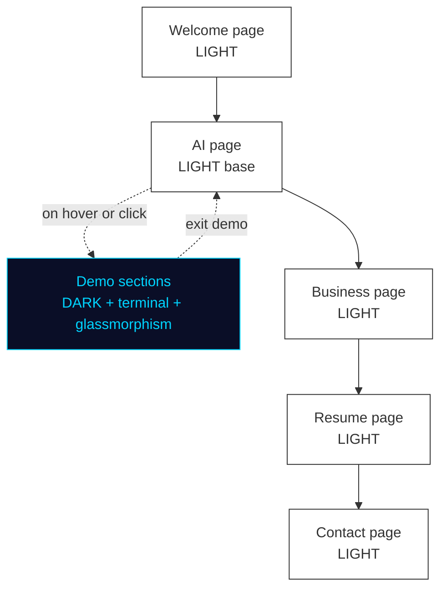

# Design System & Visual Direction

## Mode Strategy
- **Primary mode:** Light (dominant across most of the site)
- **Light mode style:** Sans-serif, professional, clean — no ornamentation
- **Dark mode:** Used selectively in specific sections (not site-wide toggle)
- **Dark mode style:** Cool blue/cyan accent palette, terminal monospace font, glassmorphism

## Color Palette (direction)
- **Dark mode accents:** Cool blue (#00D4FF range) / cyan — "modern dev/AI feel"
- **Light mode:** Clean whites, light grays, black text — professional and minimal
- **Glassmorphism:** frosted glass cards with subtle blue/cyan glow in dark sections
- Exact hex values: TBD during brandkit phase

## Typography
- **Light mode:** Clean sans-serif (e.g., Inter, Geist, or similar)
- **Dark/terminal mode:** Monospace terminal font (e.g., JetBrains Mono, Fira Code, Geist Mono)
- No percentage-bar skill indicators anywhere on the site

## Effects & Animation
- **Typing animation:** In dark-mode / terminal-look sections only (NOT in the hero)
- **Terminal windows:** Appear as styled components in dark sections of the site
- **Glassmorphism:** Frosted-glass card style throughout (especially dark sections)
- **Floating icons:** Hero graphic — icons connected by thin lines (like the Gerald Dixon reference)

---

## Layout Architecture

### Homepage layout (wireframe)

```
┌─────────────────────────────────────────────────────────────────────┐
│  [PILL NAV: Welcome | AI | Business | Resume | Get in Touch]   [icons] │
├─────────────────────────────────────────────────────────────────────┤
│                                                                       │
│  ┌──────────────┐    ┌──────────────────────────────────────────┐  │
│  │              │    │                                            │  │
│  │   STICKY     │    │   HERO                                     │  │
│  │   SIDEBAR    │    │   "Hello,"  [photo + floating icons]      │  │
│  │              │    │                Pierre Belon Savon         │  │
│  │   [Photo]    │    │   Hero one-liner (Option B)               │  │
│  │              │    │                                            │  │
│  │   Bio text   │    ├──────────────────────────────────────────┤  │
│  │              │    │   ABOUT ME                                │  │
│  │  [GH] [Li]   │    │   "Two years ago I supervised a hotel..." │  │
│  │  [📞] [✉]    │    ├──────────────────────────────────────────┤  │
│  │              │    │   MY STACK (category grid, no % bars)     │  │
│  │  (fixed)     │    │   AI · Frontend · Backend · DB · Tools    │  │
│  │              │    ├──────────────────────────────────────────┤  │
│  │              │    │   METRICS STRIP                           │  │
│  │              │    │   48hrs→3min · 100+ items · 6 trained...  │  │
│  │              │    ├──────────────────────────────────────────┤  │
│  │              │    │   CTA → Get in Touch                      │  │
│  └──────────────┘    └──────────────────────────────────────────┘  │
│                                                                       │
│  [FOOTER]                                                            │
└─────────────────────────────────────────────────────────────────────┘
```

### Mode flow (light dominant, dark selective)



### Navigation
- Clean pill/tab-style center nav (like Gerald Dixon reference)
- No logo, no brand name, no personal name in nav
- Right side of nav: icon links — GitHub, LinkedIn, phone, email
- **Section labels (LOCKED):** Welcome | AI | Business | Resume | Get in Touch

### Homepage — Sticky Left Sidebar (homepage only)
- Fixed left panel while right side scrolls
- Contains: photo of Pierre, short description, contact icons
- Inspiration: sawad.framer.website layout
- Contact icons: GitHub, LinkedIn, phone, email

### Hero Section
- Layout inspiration: Gerald Dixon reference image
- Components:
  - "Hello," greeting (large)
  - Photo of Pierre (center, background-removed)
  - Full name displayed large on right
  - Role/keyword labels on left (floating, connected by thin lines): AI Engineer / relevant tags
  - Floating tool/app icons connected by thin lines around photo:
    **GitHub, Zapier, React, MySQL, Next.js, Express.js, JavaScript**
  - Hero one-liner below name: TBD (3 options drafted, user to select)
  - Pill-style center nav integrated at top

### Hero Description (LOCKED — Option B selected)
> "Engineering intelligent automation and full-stack applications that turn complex business processes into scalable, profitable systems."

### Tech Stack Section (separate from hero)
- Category grid layout (like the aaabadcode.com inspiration)
- Categories: Frontend / Backend / Database / Tools / AI & Automation
- Icon + label for each technology — NO percentage bars
- Technologies to include:
  - Frontend: JavaScript, TypeScript, React, Next.js, Tailwind CSS
  - Mobile: Flutter, KMP (Kotlin)
  - Backend: Node.js, Express.js
  - Database: Supabase (PostgreSQL), MySQL
  - AI & Automation: Claude, Codex, ChatGPT, MCP, Zapier, n8n, Twilio, Guesty API
  - Infra/Deploy: Vercel, GitHub
  - Design: Figma, Framer
  - IDEs: VS Code, Antigravity, Cursor

---

## Reference Sites
| Reference | What to take from it |
|-----------|----------------------|
| Gerald Dixon portfolio (screenshot provided) | Hero layout, floating icon connections, pill nav, photo composition |
| aaabadcode.com | Page layout, timeline style, font pairing — NOT the skill percentage bars |
| sawad.framer.website | Fixed left sidebar with photo + contact (homepage only) |

---

## Photo Asset
- No photo yet. Pierre to take phone photo → use remove.bg or Canva background remover.
- Final asset needed: transparent PNG, portrait orientation, professional but approachable.
- **Flag:** Photo asset is a blocker for hero implementation.

---

## Social / Contact Icons (LOCKED)
- GitHub (belonsavon-sys)
- LinkedIn (to create)
- Phone: 360-660-2460
- Email: belonsavon@gmail.com
- Style: icon-only links, clean (reference: second screenshot provided)
- **X/Twitter and Instagram: excluded — Pierre has no active accounts on these platforms**

---

## Brand Kit Checklist (to build)
- [ ] Color tokens (light + dark mode)
- [ ] Typography scale
- [ ] Spacing system
- [ ] Icon set (hero floating icons, nav icons, contact icons)
- [ ] Glassmorphism card component spec
- [ ] Terminal window component spec
- [ ] Button variants
- [ ] Section divider / transition style between light and dark zones
