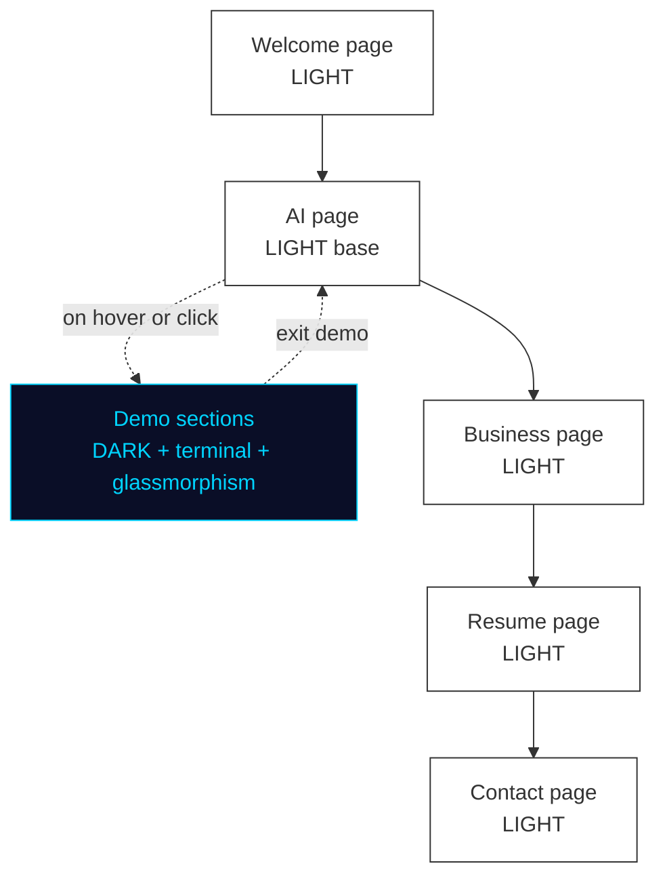

# Design System & Visual Direction

## Mode Strategy
- **Primary mode:** Light (dominant across most of the site)
- **Light mode style:** Sans-serif, professional, clean — no ornamentation
- **Dark mode:** Used selectively in specific sections (not site-wide toggle)
- **Dark mode style:** Blue accent palette, terminal monospace font, glassmorphism

## Color Palette (LOCKED)

### Primary Accent — Blue
| Token | Hex | Usage |
|-------|-----|-------|
| `--accent` | `#296ed6` | Primary accent — buttons, links, active nav, glow source |
| `--accent-light` | `#5B9BF4` | Hover states, light-mode accent text, icon highlights |
| `--accent-deep` | `#1A4E9C` | Active/pressed states, deep glow layers |

### Dark Sections (terminal, glassmorphism, demo areas)
| Token | Hex | Usage |
|-------|-----|-------|
| `--bg-dark` | `#0A0E1A` | Dark section background — near-black with blue undertone |
| `--bg-dark-2` | `#111827` | Card/panel background in dark sections |
| `--glass-bg` | `rgba(41, 110, 214, 0.10)` | Glassmorphism card fill |
| `--glass-border` | `rgba(41, 110, 214, 0.25)` | Glassmorphism card border |
| `--glass-glow` | `rgba(41, 110, 214, 0.35)` | Box shadow glow on glass cards |
| `--text-dark` | `#F8FAFC` | Primary text on dark backgrounds |
| `--text-dark-muted` | `#94A3B8` | Secondary/muted text on dark backgrounds |

### Light Sections (all other pages/sections)
| Token | Hex | Usage |
|-------|-----|-------|
| `--bg-light` | `#FFFFFF` | Page background |
| `--bg-light-2` | `#F8FAFC` | Subtle section alternation |
| `--border-light` | `#E2E8F0` | Card borders, dividers |
| `--text-light` | `#0F172A` | Primary text on light backgrounds |
| `--text-light-muted` | `#64748B` | Secondary/muted text on light backgrounds |

### Semantic (used in case study before/after diagrams)
| Token | Hex | Usage |
|-------|-----|-------|
| `--result-green` | `#10B981` | "After" / positive outcome indicators |
| `--result-green-bg` | `#D1FAE5` | "After" block fills in Mermaid/diagrams |
| `--problem-red` | `#EF4444` | "Before" / problem state indicators |
| `--problem-red-bg` | `#FEE2E2` | "Before" block fills in Mermaid/diagrams |

## Typography (LOCKED)

| Token | Font | Usage |
|-------|------|-------|
| `--font-sans` | Geist | All body text, headings, nav, UI labels — light sections |
| `--font-mono` | Geist Mono | Terminal windows, code, typing animations — dark sections |

- Source: `next/font/google` (Vercel-native, zero layout shift)
- No percentage-bar skill indicators anywhere on the site

## Spacing Scale (LOCKED)

Base unit: 8px. Aligned to Tailwind's default spacing scale — use Tailwind classes in implementation; tokens listed here for reference.

| Token | Value | Tailwind | Usage |
|-------|-------|----------|-------|
| `--space-1` | `4px` | `p-1` / `gap-1` | Tight gaps — icon padding, tag spacing |
| `--space-2` | `8px` | `p-2` / `gap-2` | Base unit |
| `--space-3` | `12px` | `p-3` / `gap-3` | Small component padding |
| `--space-4` | `16px` | `p-4` / `gap-4` | Default padding |
| `--space-6` | `24px` | `p-6` / `gap-6` | Section sub-elements |
| `--space-8` | `32px` | `p-8` / `gap-8` | Card padding, component gaps |
| `--space-12` | `48px` | `p-12` / `gap-12` | Section spacing (mobile) |
| `--space-16` | `64px` | `p-16` / `gap-16` | Section spacing (desktop) |
| `--space-24` | `96px` | `p-24` / `gap-24` | Hero / large section padding |

## Effects & Animation
- **Typing animation:** In dark-mode / terminal-look sections only (NOT in the hero)
- **Terminal windows:** Appear as styled components in dark sections of the site
- **Glassmorphism:** Frosted-glass card style throughout (especially dark sections)
- **Floating icons:** Hero graphic — icons connected by thin lines (like the Gerald Dixon reference)

## Glassmorphism Card Spec (LOCKED)

Used in: demo section cards, Atlas panes, service cards in dark sections, terminal windows.

```css
/* Base state */
background:        rgba(41, 110, 214, 0.10);   /* --glass-bg */
border:            1px solid rgba(41, 110, 214, 0.25);  /* --glass-border */
border-radius:     12px;
backdrop-filter:   blur(12px);
-webkit-backdrop-filter: blur(12px);
box-shadow:        0 0 24px rgba(41, 110, 214, 0.35);  /* --glass-glow */

/* Hover state (Framer Motion) */
box-shadow:        0 0 36px rgba(41, 110, 214, 0.55);
border-color:      rgba(41, 110, 214, 0.45);
scale:             1.02;
transition:        all 0.2s ease;
```

**Rule:** Glassmorphism only appears when the background is dark (`--bg-dark` or `--bg-dark-2`). Never on light section backgrounds.

## Terminal Window Component Spec (LOCKED)

Used in: Demo 2 Atlas panes, any terminal-style section in dark areas.

```
┌─────────────────────────────────────────────────────┐
│  ● ● ●                                    atlas      │  ← title bar
├─────────────────────────────────────────────────────┤
│                                                     │
│  > Initializing CEO agent...                        │
│  > Routing to CFO and CMO...                        │
│  > Field agents deployed                            │
│  $ █                                                │  ← blinking cursor
│                                                     │
└─────────────────────────────────────────────────────┘
```

```css
/* Window container */
background:     #111827;        /* --bg-dark-2 */
border-radius:  12px;
overflow:       hidden;

/* Title bar */
background:     #1E2433;
height:         36px;
padding:        0 12px;
display:        flex;
align-items:    center;
gap:            6px;

/* Dot buttons (decorative only) */
width: 12px; height: 12px; border-radius: 50%;
colors: #EF4444 (red) / #F59E0B (yellow) / #10B981 (green)

/* Terminal body */
font-family:    Geist Mono;
font-size:      14px;
padding:        16px;
line-height:    1.6;

/* Line states */
--line-active:    #296ed6;    /* current typing line */
--line-done:      #94A3B8;    /* completed lines */
--line-text:      #F8FAFC;    /* standard output */

/* Cursor */
content: "█";
animation: blink 1s step-end infinite;
```

**Typing animation:** Characters appear one at a time on the active line. On completion, line transitions to `--line-done` color and next line begins.

---

## Layout Architecture

### Homepage layout (wireframe)

```
┌─────────────────────────────────────────────────────────────────────┐
│  [PILL NAV: Welcome | AI | Business | Resume | Get in Touch]   [icons] │
├─────────────────────────────────────────────────────────────────────┤
│                                                                       │
│  ┌──────────────┐    ┌──────────────────────────────────────────┐  │
│  │              │    │                                            │  │
│  │   STICKY     │    │   HERO                                     │  │
│  │   SIDEBAR    │    │   "Hello,"  [photo + floating icons]      │  │
│  │              │    │                Pierre Belon Savon         │  │
│  │   [Photo]    │    │   Hero one-liner (Option B)               │  │
│  │              │    │                                            │  │
│  │   Bio text   │    ├──────────────────────────────────────────┤  │
│  │              │    │   ABOUT ME                                │  │
│  │  [GH] [Li]   │    │   "Two years ago I supervised a hotel..." │  │
│  │  [📞] [✉]    │    ├──────────────────────────────────────────┤  │
│  │              │    │   MY STACK (category grid, no % bars)     │  │
│  │  (fixed)     │    │   AI · Frontend · Backend · DB · Tools    │  │
│  │              │    ├──────────────────────────────────────────┤  │
│  │              │    │   METRICS STRIP                           │  │
│  │              │    │   48hrs→3min · 100+ items · 6 trained...  │  │
│  │              │    ├──────────────────────────────────────────┤  │
│  │              │    │   CTA → Get in Touch                      │  │
│  └──────────────┘    └──────────────────────────────────────────┘  │
│                                                                       │
│  [FOOTER]                                                            │
└─────────────────────────────────────────────────────────────────────┘
```

### Mode flow (light dominant, dark selective)



### Navigation
- Clean pill/tab-style center nav (like Gerald Dixon reference)
- No logo, no brand name, no personal name in nav
- Right side of nav: icon links — GitHub, LinkedIn, phone, email
- **Section labels (LOCKED):** Welcome | AI | Business | Resume | Get in Touch

### Homepage — Sticky Left Sidebar (homepage only)
- Fixed left panel while right side scrolls
- Contains: photo of Pierre, short description, contact icons
- Inspiration: sawad.framer.website layout
- Contact icons: GitHub, LinkedIn, phone, email

### Hero Section
- Layout inspiration: Gerald Dixon reference image
- Components:
  - "Hello," greeting (large)
  - Photo of Pierre (center, background-removed)
  - Full name displayed large on right
  - Role/keyword labels on left (floating, connected by thin lines): AI Engineer / relevant tags
  - Floating tool/app icons connected by thin lines around photo:
    **GitHub, Zapier, React, MySQL, Next.js, Express.js, JavaScript**
  - Hero one-liner below name: TBD (3 options drafted, user to select)
  - Pill-style center nav integrated at top

### Hero Description (LOCKED — Option B selected)
> "Engineering intelligent automation and full-stack applications that turn complex business processes into scalable, profitable systems."

### Tech Stack Section (separate from hero)
- Category grid layout (like the aaabadcode.com inspiration)
- Categories: Frontend / Backend / Database / Tools / AI & Automation
- Icon + label for each technology — NO percentage bars
- Technologies to include:
  - Frontend: JavaScript, TypeScript, React, Next.js, Tailwind CSS
  - Mobile: Flutter, KMP (Kotlin)
  - Backend: Node.js, Express.js
  - Database: Supabase (PostgreSQL), MySQL
  - AI & Automation: Claude, Codex, ChatGPT, MCP, Zapier, n8n, Twilio, Guesty API
  - Infra/Deploy: Vercel, GitHub
  - Design: Figma, Framer
  - IDEs: VS Code, Antigravity, Cursor

---

## Reference Sites
| Reference | What to take from it |
|-----------|----------------------|
| Gerald Dixon portfolio (screenshot provided) | Hero layout, floating icon connections, pill nav, photo composition |
| aaabadcode.com | Page layout, timeline style, font pairing — NOT the skill percentage bars |
| sawad.framer.website | Fixed left sidebar with photo + contact (homepage only) |

---

## Photo Asset
- No photo yet. Pierre to take phone photo → use remove.bg or Canva background remover.
- Final asset needed: transparent PNG, portrait orientation, professional but approachable.
- **Flag:** Photo asset is a blocker for hero implementation.

---

## Social / Contact Icons (LOCKED)
- GitHub (belonsavon-sys)
- LinkedIn (to create)
- Phone: 360-660-2460
- Email: belonsavon@gmail.com
- Style: icon-only links, clean (reference: second screenshot provided)
- **X/Twitter and Instagram: excluded — Pierre has no active accounts on these platforms**

---

## Brand Kit Checklist (to build)
- [ ] Color tokens (light + dark mode)
- [ ] Typography scale
- [ ] Spacing system
- [ ] Icon set (hero floating icons, nav icons, contact icons)
- [ ] Glassmorphism card component spec
- [ ] Terminal window component spec
- [ ] Button variants
- [ ] Section divider / transition style between light and dark zones
