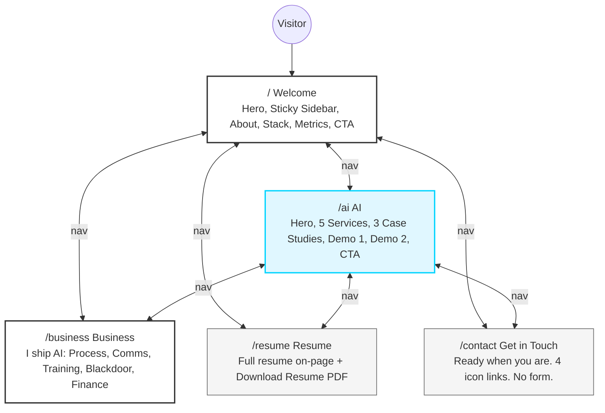
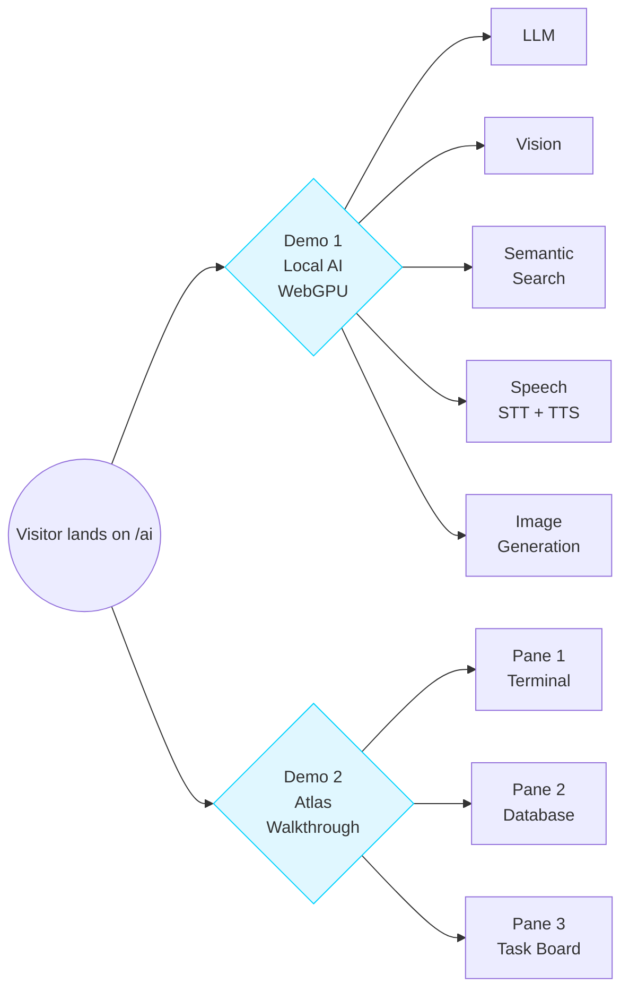
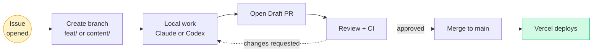

# Project Scope — Pierre Belon Savon Portfolio

## Goal
A professional AI Engineer portfolio website that communicates value in business terms (outcomes, ROI, efficiency) with only brief mentions of technology. Built with Next.js App Router, deployed on Vercel, designed for business clients and technical recruiters.

## Target Audience
1. **Technical recruiters** — seeking AI Engineer candidates
2. **Business decision-makers / SMB owners** — considering AI automation or full-stack product development
3. **Potential clients for Blackdoor** — agentic company projects across entertainment, SaaS, robotics, AI

## Content-First Rule
All resume and page copy lives in `context/` and must be finalized before any UI work begins.

---

## Site Map



| Page | Route | Description |
|------|-------|-------------|
| Welcome | `/` | About Pierre — hero, sticky sidebar (homepage only), about, tech stack |
| AI | `/ai` | **Merged AI + Technology page.** Process automation, agent systems, full-stack demos — all 2 demos live here |
| Business | `/business` | Operations, process development, QA, hospitality leadership, Blackdoor |
| Resume | `/resume` | Viewable resume + B&W PDF download |
| Get in Touch | `/contact` | Headline + 4 icon links — **no form** |

> **Note:** Technology page removed. All technical content and demos consolidated into `/ai`.

## Sections Within Pages (high-level)

### Home (`/`)
- Sticky left sidebar: photo, short bio, contact icons (homepage only)
- Nav: pill/tab style, center; icons right (GitHub, LinkedIn, phone, email)
- Hero: greeting, photo, name, role tags, floating tool icons, hero one-liner
- About section
- Tech stack grid (categorized, no % bars)
- Metrics / achievements strip
- CTA → Contact

### AI Page (`/ai`) — merged with Technology
- Page hero: business-framed intro to AI automation + full-stack capability
- Process automation case studies:
  - Guest chatbot: 48hrs → 3min response time, 15–20 min saved per message
  - Inspection digitization: 100+ page manual → trackable QA system
  - Zapier + Guesty + Twilio workflow automation
- **Demo 1 — Live AI in your browser:** 5-tab interactive modal running models locally via WebGPU
  - Tabs: LLM | Vision | Semantic Search | Image Classification | Text-to-Speech
  - Each tab framed as a business use case (e.g., on-device LLM for private data, vision for quality inspection)
- **Demo 2 — Atlas harness walkthrough:** Visualizes the agent pipeline — prompt in → CEO agent routes → sub-agents act → files open, tasks complete
- **Demo 3 — Playground:** Interactive vibe-coding playground (live AI build)
- Full-stack web + mobile capabilities (business-framed)
- CTA

### Business Page (`/business`)
- Process development: the inspection checklist / QA system
- Customer service systems (chatbot, guest communications)
- Inventory management (100+ items)
- Trainer experience (SOPs, checklists, 6 staff trained)
- Hotel operations leadership (supervisor, manager meetings, reports, Hawaii leadership retreat)
- Process improvement methodology
- Finance / accounting data entry (QuickBooks, 6 months, error-free)
- Blackdoor: holding company overview (business framing across entertainment, SaaS, robotics, AI)

### Contact (`/contact`) — "Get in Touch"
- **No contact form** — icon links only (GitHub, LinkedIn, phone, email)
- Headline: "Ready when you are."
- Body: "Currently open to the right opportunity. Remote roles and freelance projects welcome. I reply within 24 hours."

### Resume (`/resume`)
- Viewable resume showing all sections: summary, experience, independent projects, skills, education, languages
- Civil engineering entry: **keep** (Texas A&M, 2019–2020 — shows foundation and ambition)
- Download button: "Download Resume"
- PDF format: clean traditional black-and-white (ATS-friendly, no dark mode)
- No cover letter section on this page (cover letter is a separate asset)

---

## Technology Stack

| Layer | Choice |
|-------|--------|
| Framework | Next.js (App Router) |
| Language | TypeScript |
| Styling | Tailwind CSS + custom CSS variables |
| Animation | Framer Motion |
| Database | Supabase (if contact form needs persistence) |
| Deployment | Vercel |
| CMS/Content | `context/` folder (flat files, no headless CMS needed) |

## AI Tooling Split
| Tool | Role |
|------|------|
| Claude | Thinking, design decisions, architecture, copy, documentation |
| Codex | Code implementation only |
| GitHub | All work via PRs; no direct pushes to main |

---

## Demos (all on `/ai` page — 2 demos total)

### Demo flow overview



### Demo 1 — Live AI in your browser (WebGPU)
- Format: 5-tab interactive modal — models run locally in-browser via WebGPU (zero server cost, zero data leakage)
- **Tabs (LOCKED): LLM | Vision | Semantic Search | Speech | Image Generation**
  - **LLM** (Gemma 4 preferred, or Llama 2B): Mini harness UI on left — business-context folders, tools (API/MCP), AGENTS.md. Pre-seeded business prompts + free-text input. Demonstrates grounding, prompt engineering, harness architecture.
  - **Vision** (Gemma 4 vision or small vision model): User uploads image → detailed classification + alternatives + confidence % — framed for inventory mgmt, ML training, QA inspection.
  - **Semantic Search** (embeddings model): Business dataset understanding, data analytics, ranked alternatives — framed for ops or LLM training.
  - **Speech** (STT + TTS combined): Transcribe audio → text (meeting notes) AND read text → audio with expression, turn-based multi-speaker.
  - **Image Generation** (Gemma 4 imagen or similar): Generate product mockups and business visual assets on demand.
- Overall thesis: Local AI is the next cost-reduction frontier — modern hardware can already run it, businesses just haven't deployed it.
- Note: Gemma 4 can power multiple tabs from a single model load.

### Demo 2 — Atlas harness walkthrough
- **Layout: 3 panes side by side**
  - Pane 1 — Terminal runtime: user enters prompt → Atlas routes work, agent delegation scrolls in real time
  - Pane 2 — Database: live records being written/updated as agents act
  - Pane 3 — Task UI: mini project board (Linear-style) — tasks appear, get assigned, get marked done
- Mode: Simulated (scripted to look live)
- End state: Task board showing completed or created task

---

## GitHub Workflow Rules

### Workflow visualization



### Branch Strategy
- `main` — production, Vercel deploys from here
- `develop` — integration branch
- Feature branches: `feat/<short-name>`
- Content branches: `content/<short-name>`
- Fix branches: `fix/<short-name>`
- Claude planning branches: `claude/<description>`

### PR Rules
- All changes via PR — no direct pushes to `main` or `develop`
- PR must have: title, description, label(s), linked issue(s)
- Codex: code implementation PRs only
- Claude: architecture, design, documentation, copy PRs
- PRs created as draft → review → ready for merge

### Labels (to create)
- `content` — resume, copy, context files
- `design` — UI/UX, brandkit, visual direction
- `ai-page` — AI page work
- `business-page` — Business page work
- `home-page` — Homepage work
- `contact-page` — Contact page work
- `resume` — Resume/cover letter work
- `infrastructure` — gitignore, AGENTS.md, config, CI/CD
- `demo` — demo sections
- `milestone:content` — content/planning phase
- `milestone:design` — design/brandkit phase
- `milestone:build` — implementation phase
- `milestone:deploy` — deployment and QA phase
- `blocked` — blocked on an asset or decision
- `needs-info` — waiting for user input

### Milestones
1. **Phase 1 — Content & Resume** — All context files populated; resume finalized
2. **Phase 2 — Design & Brandkit** — Color tokens, typography, component specs finalized
3. **Phase 3 — Build** — All pages implemented
4. **Phase 4 — Deploy** — Vercel deployment, domain, QA

---

## Deployment
- Platform: Vercel
- Trigger: push to `main` via merged PR
- Environment variables: managed in Vercel dashboard
- Domain: TBD

---

## Assets Needed (blockers)
- [x] Hero photo selected (Photo 3 — gray collared shirt selfie). Pierre to save to `public/hero-photo.png` and run through remove.bg.
- [x] About section photos selected (Photo 1 guitar + Photo 2 Hawaii/Buddha). Pierre to save to `public/about-guitar.jpg` and `public/about-hawaii.jpg`.
- [ ] LinkedIn profile created
- [ ] University name + dates for civil engineering entry
- [ ] Metrics from hotel work (response times, inspection coverage, etc.) — marked TBD
- [ ] Hero description: **SELECTED — Option B:** "Engineering intelligent automation and full-stack applications that turn complex business processes into scalable, profitable systems."
- [ ] Demo video content (Tutorial demo, Integrations demo, Vibe coding demo)
- [ ] Cover letter draft
- [ ] Final domain name decision

---

## File Structure (planned)

```
portfolio/
├── context/                    # All content — source of truth before any code
│   ├── resume.md
│   ├── design.md
│   ├── project-scope.md
│   ├── cover-letter.md         # TBD
│   └── copy/                   # Page-by-page copy (TBD)
│       ├── home.md
│       ├── ai.md
│       ├── business.md
│       ├── technology.md
│       └── contact.md
├── src/
│   └── app/                    # Next.js App Router
│       ├── layout.tsx
│       ├── page.tsx            # Home
│       ├── ai/
│       │   └── page.tsx
│       ├── business/
│       │   └── page.tsx
│       ├── technology/
│       │   └── page.tsx
│       ├── contact/
│       │   └── page.tsx
│       └── resume/
│           └── page.tsx
├── public/                     # Static assets
├── .gitignore
├── AGENTS.md                   # AI agent instructions
├── CLAUDE.md                   # Claude-specific instructions
└── README.md
```

---

## AGENTS.md Purpose
- Instructions for Codex (code implementation only)
- Instructions for Claude (thinking, design, copy, architecture)
- Branch and PR rules
- Context folder usage instructions
- Prohibited actions (no direct main pushes, no skipping PR review)
