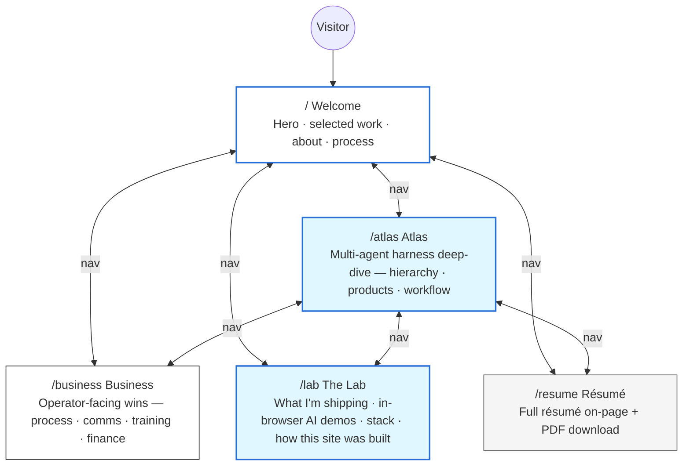

# Project Scope — Pierre Belon Savon Portfolio

## Goal
A professional AI Engineer portfolio that communicates value in business terms (outcomes, ROI, efficiency) with the technical depth available for anyone who wants to look. Built with Next.js App Router, deployed on Vercel, written for both business decision-makers and technical recruiters.

## Target audience
1. **Technical recruiters** — looking for an AI Engineer who can ship
2. **Business decision-makers / SMB owners** — considering AI automation or full-stack product development
3. **Potential clients for Blackdoor** — agentic-systems work across entertainment, SaaS, robotics, AI

## Content-first rule
All page copy and résumé content lives in `context/` and is finalized before UI work begins.

---

## Site map

| Page | Route | What it does |
|------|-------|--------------|
| Welcome | `/` | Who I am · what I ship · how I work — single-page intro |
| Atlas | `/atlas` | Deep-dive on the multi-agent harness — schematic blueprint, datasheet rows, ShipFlow trace, and the two live AI demos |
| Business | `/business` | Operator-facing wins. Bento grid · before/after diagrams · finance precision card |
| The Lab | `/lab` | What I'm shipping right now · in-browser AI demos · tools I pay for · how this site was built |
| Résumé | `/resume` | Full résumé on-page · PDF download · B&W print stylesheet |

> Earlier route candidates (`/ai`, `/contact`, `/colophon`, `/now`, `/uses`) were folded into the current five routes. AI content lives on `/atlas`. Contact lives in the footer + `/resume`. Build-process notes folded into `/lab`. Current-work notes folded into the Lab's "What I'm shipping" section.

---

## Sections within pages (high-level)

### `/` Welcome
- Hero: gradient title (Pierre Belon Savon) with GSAP reveal, live commit ticker, last-shipped feed
- About strip: who I am, what I'm currently shipping
- Selected work: metric-forward tiles linking into `/atlas`, `/business`, `/lab`
- Process / how I ship: brief verbs that cross-link to receipts
- Closing band → CTA

### `/atlas` Atlas
- Hero: GSAP-revealed gradient title "A harness that ships." + intro
- 01 · Hierarchy: schematic blueprint (5 layers, engine chip, bus wires) + datasheet rows with GSAP ScrollTrigger cascade
- 02 · Products: vertical build manifest of live products
- 03 · Workflow: ShipFlow component — flow / code segmented toggle, perimeter-trace diagram as default
- ChapterRail navigation, SiteFooter

### `/business` Business
- Hero: "I ship AI." with gradient + intro
- Bento grid of operator-facing capabilities
- Before/after diagrams
- Finance precision card
- ChapterRail

### `/lab` The Lab
- Hero: "The lab."
- What I'm shipping right now
- In-browser AI demos (5 tabs: classification, LLM chat, vision, speech, semantic search) — on-device via WebGPU/WASM
- Atlas multi-agent demo (live Anthropic call or scripted fallback)
- Tools I pay for
- How this site was built

### `/resume` Résumé
- Hero: name title + role tags + download PDF CTA
- Professional summary
- Role entries with role-name + dates + responsibilities + outcomes
- Skills (light groupings, no % bars)
- Education
- ChapterRail

---

## Interaction language

The site has one cohesive interaction layer reused everywhere. See [`design.md`](./design.md) for the motion specifics.

- **Flashlight dark mode** — PCB rocker switch top-left flips the whole site between light and dark, using a direction-aware View Transitions API reveal that originates from the switch coords. In dark mode the cursor becomes a lamp (X-ray schematic + accent bloom in a cursor-following mask). Section headers stay in a green-neon "hack" visual.
- **Hero gradient reveal** — every page hero is a GSAP `clip-path` left-to-right reveal landing on the `.gradient-shift` color sweep. Hover triggers chromatic-aberration glitch on the `.auto-glitch` parent.
- **Datasheet cascade** — `/atlas` hierarchy rows assemble (refdes → title clip → body → KPI stagger) as they enter the viewport, via GSAP ScrollTrigger.
- **GlitchTitle** — section headers run subtle micro-flickers at rest with a 5-second emerald x-ray pop. The line, chapter index, and meta caption all share the same 71→72 on / 87→88 off keyframes for perfect sync.

---

## Demos (all on `/atlas`)

### Local AI — 5 tasks, zero cloud
| Tab | Model | Task |
|-----|-------|------|
| Image Classification | MobileNet v4 | Top-5 ImageNet classification |
| LLM Chat | SmolLM2-135M | On-device text generation |
| Computer Vision | CLIP ViT-B/16 | Live webcam zero-shot gesture classification |
| Speech to Text | Whisper Tiny.en | Audio file → transcript |
| Semantic Search | mxbai-embed-xsmall | Embeddings + cosine ranking |

Loads via `@huggingface/transformers`, runs on WebGPU when available, falls back to WASM. Models cache per-tab.

### Atlas harness — multi-agent routing
The user types a brief. The Node API route at `/api/atlas/run` calls `gpt-4o-mini` (via the OpenAI SDK) with a system prompt that returns structured agent-routing JSON. The 3-pane UI plays back the live response (terminal stream · DB rows · task board). Falls back to a scripted simulation when no `OPENAI_API_KEY` is set or the IP-rate-limited window (3/hour) is exhausted.

---

## Out of scope

- A blog or news feed
- Contact form spam vectors (we link mailto + Linear / GitHub instead)
- Server-rendered analytics — `@vercel/analytics` covers it client-side
- Account/login or any auth flow

---

## Hosting / deployment

- Vercel (Fluid Compute) — main branch deploys to production, every PR gets a preview URL
- `OPENAI_API_KEY` lives in Vercel env vars
- `@vercel/analytics` + `@vercel/speed-insights` enabled
- Sitemap + robots.txt generated by App Router (`sitemap.ts`, `robots.ts`)
